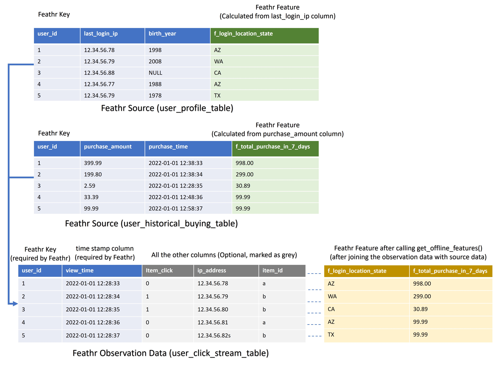
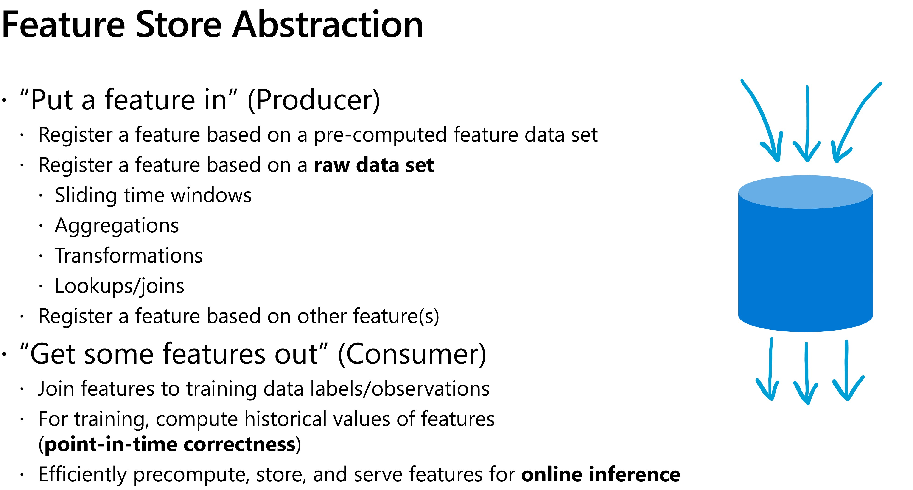
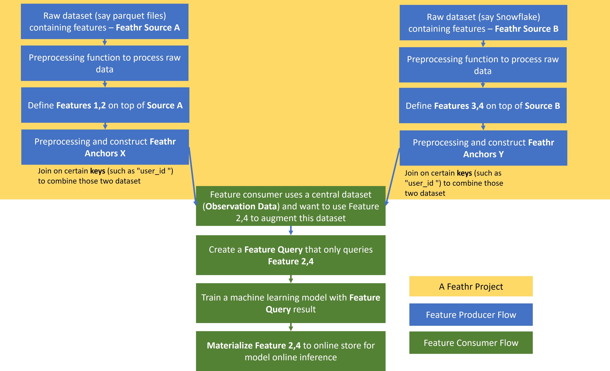

# Concepts for Beginners

In this guide, we will cover the high level concepts for **Feathr**. Don't treat this as a user manual, instead treat this as blog post to cover the high level motivations on why Feathr introduces those concepts.

## What are `Observation` data, and why does Feathr need `key(s)`, `Anchor`, `Source`?

In order to fully utilize Feathr's power, we need to understand what Feathr is expecting. Let's take an example of building a recommendation system, where you have a user click streams and you want to add additional features on top of this click streams, say user historical clicks in last 1 hour, and the user locations.



In Feathr, always think that there is some `Observation` dataset (the above case will be the click streams) which is the central dataset that you will be using. The observation dataset will usually have at least two columns:

- a timestamp column (indicating when this event happened)
- a column containing IDs, and with other possible fields.

Think this `Observation Data` just as a set of IDs that you want to query on, and that is why some other feature store call this "Entity DataFrame". Also this observation data usually come with timestamp so you can do [point in time join](#point-in-time-joins-and-aggregations).

Because the observation data just contains ID and timestamp, usually you will need additional features to augment this `observation` dataset. For example, you want to augment the user click stream data by adding some historical features, such as total amount user spent in the last week. This additional dataset is usually stored in a different storage, say in your historical database, or data lake.

In this case, how would we "link" the `observation` dataset, and the "additional dataset"? In Feathr, think of this process as joining two tables.

Since this is a table join process, we need to specify which `key(s)` that the join would happen. Those `keys` are usually some IDs, but can be others as well. In the above example, if we want to augment the user click stream data with user purchase history, we will use the user ID as `key`, so that the `user_click_stream` table and the `user_historical_buying` table can be joined together. That's why you need to specify `keys` in Feathr `Feature`, because you will need to join your `Feature` with your `Observation Data` later on.

Since those additional features are from different sources, we want to define an `Anchor` to process it further. Think `Anchor` as a `Feature View`, where it is a collection of features and their corresponding sources. Think `Feature` just as a column in your dataset but it contains some useful information that you want to use in your machine learning scenario.

`Source` in Feathr just represents the source data that you will need to use to extract features from. It also comes with handy customizations that you can run almost arbitrary PySpark/SparkSQL code.

That's why you will see something like below, where you define a Feathr Source (in this case it's an HDFS like source) and corresponding features, and then compose an `Anchor` that combines the `Features` and `Source`.

```python
batch_source = HdfsSource(name="nycTaxiBatchSourcePurview",
                          path="wasbs://public@azurefeathrstorage.blob.core.windows.net/sample_data/feathr_delta_table",
                          event_timestamp_column="lpep_dropoff_datetime",
                          timestamp_format="yyyy-MM-dd HH:mm:ss")
features = [
    Feature(name="f_is_long_trip_distance",
            feature_type=BOOLEAN,
            transform="cast_float(trip_distance)>30"),
    Feature(name="f_day_of_week",
            feature_type=INT32,
            transform="dayofweek(lpep_dropoff_datetime)"),
]

request_anchor = FeatureAnchor(name="request_features",
                               source=batch_source,
                               features=features)
```

## Motivation on `Derived Feature`

That sounds all good, but what if we want to share a feature, and others want to build additional features on top of that feature? Thats's why there is a concept in Feathr called `derived feature`, which allows you to calculate features based on other features, with certain transformation support.

In practice, people can build features on top of other features. For example, you have a recommendation system, one of your teammates have built an embedding for users, and another team mate have built an embedding on items, and you can build an additional feature called "user_item_similarity" on those two features:

```python
# Another example to compute embedding similarity
user_embedding = Feature(name="user_embedding", feature_type=DENSE_VECTOR, key=user_key)
item_embedding = Feature(name="item_embedding", feature_type=DENSE_VECTOR, key=item_key)

user_item_similarity = DerivedFeature(name="user_item_similarity",
                                      feature_type=FLOAT,
                                      key=[user_key, item_key],
                                      input_features=[user_embedding, item_embedding],
                                      transform="cosine_similarity(user_embedding, item_embedding)")
```

## Motivation on "INPUT_CONTEXT"

In many of the cases, we not only want to define features on the source data (`user_profile_table` and `user_historical_buying_table` in the above case), but also want to define features on the observation data (`user_click_stream_table` in the above case). `INPUT_CONTEXT` simply means that those features will be defined on `Observation Data` instead of `Source`. That is why you will see something like this in Feathr:

```python
request_anchor = FeatureAnchor(name="request_features",
                               source=INPUT_CONTEXT,
                               features=features)
```

This is less recommended as it has many limitations (for example, you cannot define UDFs on top of `INPUT_CONTEXT`).

## Why does Feathr need `Feature Query`?

After setting the above concept on `Anchors`, `Sources`, and `Features`, we want to explain the motivation on `feature query`. But before that, we also want to introduce the workflows that we usually see in organizations - the "feature producer" and "feature consumer" pattern, like below:



As you can see, there are usually "feature producers" where they will define features and put them in the feature registry. Those feature producers will use the `Anchors`, `Source`, and `Feature` that we talked above to produce (or define) the features.

However, there are also a group of other people who will be the feature consumers. They don't care about how the features are defined, they "just know" that there are some features available for use, for example a feature describing user activities, which they can reuse to predict whether it is a fraud activity or not. In this case, feature consumers can select which set of features they want to put in `FeatureQuery`, so that they can get the features and join them on the input observation data.

Since this is a process where we are `joining` the observation data with the defined feature data, you need to specify the observation data location and the features you want to get, as well as the keys to join on; the result will be the observation data plus the additional features.

```python
feature_query = FeatureQuery(
    feature_list=["f_location_avg_fare", "f_trip_time_rounded", "f_is_long_trip_distance"], key=location_id)
settings = ObservationSettings(
    observation_path="wasbs://public@azurefeathrstorage.blob.core.windows.net/sample_data/green_tripdata_2020-04.csv",
    event_timestamp_column="lpep_dropoff_datetime",
    timestamp_format="yyyy-MM-dd HH:mm:ss")
client.get_offline_features(observation_settings=settings,
                            feature_query=feature_query,
                            output_path=output_path)
```

## What is "materialization" in Feathr?

You are very likely to train a machine learning model with the features that you just queried (with `get_offline_features()`). After you have trained a machine learning model, say a fraud detection model, you are likely to put the machine learning model into an online environment and do online inference.

In that case, you will need to retrieve the features (for example the user historical spending) in real time, since the fraud detection model is very time sensitive. Usually some key-value store is used for that scenario (for example Redis), and Feathr will help you to materialize features in the online environment for faster inference. That is why you will see something like below, where you specify Redis as the online storage you want to use, and retrieve features from online environment using `get_online_features()` from there:

```python
redisSink = RedisSink(table_name="nycTaxiDemoFeature")
# Materialize two features into a redis table.
settings = MaterializationSettings("nycTaxiMaterializationJob",
sinks=[redisSink],
feature_names=["f_location_avg_fare", "f_location_max_fare"])
client.materialize_features(settings)
client.get_online_features(feature_table = "agg_features",
                           key = "265",
                           feature_names = ['f_location_avg_fare', 'f_location_max_fare'])
```

## Illustration

An illustration of the concepts and process that we talked about is like this:


## Miscellaneous topics

### A bit more on `Observation Data`

The "Observation Data" is a concept that is a bit confusing for some beginners, and simply think it as an immutable dataset, but this dataset could be enhanced by other dataset. For example, you usually cannot drop a column for your "observation data", but you can add additional columns to it.

### What's the relationship between `Source` and `Anchor`?
Usually an Anchor can only have one source, but one source can be consumed by different anchors. From `Source` to `Anchor`, there might be an intermediate step, which is the "preprocessing" function and allows you to customize the input a bit. 

### Point in time joins and aggregations - why we need them?

Assuming users are already familiar with the "regular" joins, for example inner join or outer join, and in many of the use cases, we care about time.

For example, if we are building a recommendation system to predict whether a certain user will click on a item or not at 2:00. It's very important that we don't use features that's later than 2:00 in the model (which is called data leakage). This is a common problem for data scientists for building models, and that's why Feathr provides a capability called Point in time Join (and with other time based aggregations) to solve this problem. That is the motivation on why end users need to specify the timestamp column in data source, so that Feathr can take care of the point in time join.

For more details on how to utilize Feathr to perform point-in-time joins, refer to the [Point in Time Join Guide](../concepts/point-in-time-join.md)

## Next Steps

After you are familiar with the above concepts, please check out the [quick start guide](../quickstart_synapse.md) to get your hands dirty. Enjoy!
